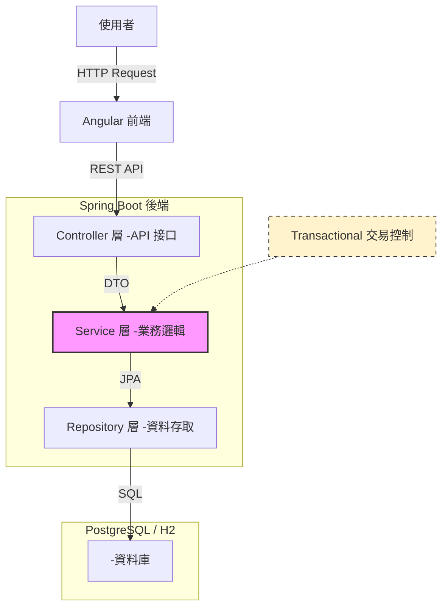

# 模擬銀行核心系統

這是一個基於 Java Spring Boot 4 與 Angular 21 開發權端銀行核心模擬系統。
本專案模擬帳戶管理、資金轉帳、交易紀錄功能。

## 技術

### 後端
* Java 25
* Spring Boot 4.0.1
* PostgreSQL
* Docker

### 前端
* Angular 21
* TypeScript
* Angular Signals
* RxJS

## 系統架構


## 核心功能

1. 資金轉帳: 
* 使用@Transactional，確保交易過程中發生錯誤，會自動Rollback
* 使用BigDecimal處理資金運算，避免精度問題
2. 交易紀錄
* 紀錄交易資料，如時間、來源、目標
* 使用PostgreSQL整合，確保系統重啟資料不會遺失
3. 前端操作
* 運用 Angular Signals 實作響應式 UI，當後端餘額變動時，前端畫面能即時且精準地更新
* 前後端分離架構，透過 RESTful API 進行通訊

## 如何執行專案
### 前置需求
* Docker & Docker Compose
* Java 25
* Node.js & npm
### 快速啟動(使用docker)
本專案已容器化資料庫，請依序執行：
1. 啟動資料庫
```cmd=
docker-compose up -d
```
2. 啟動後端
```cmd=
./mvnw spring-boot:run
```
3. [啟動前端](https://github.com/DannisMa/banking-frontend)
```cmd=
cd banking-frontend
ng serve
```

## API文件說明
| Method | Endpoint                        | Description           |
| ------ | ------------------------------- | --------------------- |
| GET    | /api/accounts/{id}              | 查詢特定帳戶餘額與資訊           |
| POST   | /api/accounts/transfer          | 執行轉帳交易（需帶入 JSON Body） |
| GET    | /api/accounts/{id}/transactions | 查詢該帳戶的歷史交易紀錄          |

